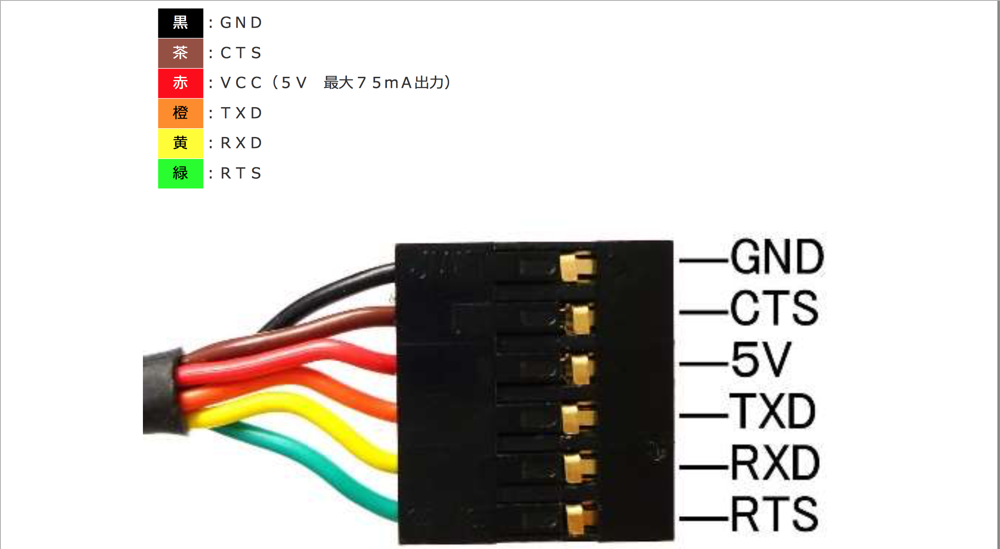

# Raspi3でのベアメタル関連情報メモ

## RaspberryPi仕様

### Raspberry Pi 2 Model B v1.2（UD-RP2）

http://www.iodata.jp/product/pc/raspberrypi/ud-rp2/spec.htm

|項目||
|---|---|
|CPU|Broadcom BCM2837<br>900MHz 64-bit quad-core ARMv8 Cortex-A53|
|メモリ|1GB|

### Raspberry Pi 3 Model B (UD-RP3)

http://www.iodata.jp/product/pc/raspberrypi/ud-rp3/spec.htm

|項目||
|---|---|
|CPU|Broadcom BCM2837<br>1.2GHz 64-bit quad-core ARMv8 Cortex-A53|
|メモリ|1GB|

## RasPiのブートプロセス等について

## ブートプロセス

https://www.raspberrypi.org/forums/viewtopic.php?f=63&t=6685

[Raspberry Pi2(Linux Kernel)のブートシーケンスを読む(その1) アーキテクチャ依存部](https://qiita.com/Nao1215/items/b8f866b4ede757cdaa73)

### config.txt

RasPiはBIOSを持たないため、ブート時の挙動については`config.txt`の記述によって決定する。

config.txtについての詳しいことについては、以下のサイトが非常に見やすい。

[RPiconfig](https://elinux.org/RPiconfig)

また、公式ドキュメントも存在する。

## 開発環境

### クロスコンパイラ

[GNU ARM Embedded Toolchain](https://launchpad.net/gcc-arm-embedded)

[Ubuntuにおける環境構築方法](http://dev.toppers.jp/trac_user/ev3pf/wiki/DevEnvLinux)

[UbuntuでSTM32 ARMマイコン開発環境を整える](https://daichiahl.wordpress.com/2016/01/23/ubuntuでstm32-armマイコンの開発環境を整える/)

### USB・シリアル変換ケーブル

UARTを用いたシリアル通信に必要。

[FTDI USB・シリアル変換ケーブル（TTL-232R-3V3）](http://akizukidenshi.com/catalog/g/gM-05840/)

[Drivers](http://www.ftdichip.com/Drivers/VCP.htm)

Linuxの場合は必要ないかもしれない。

[データシート](http://akizukidenshi.com/download/ds/ftdi/TTL-232Rシリーズ参考資料.pdf)

[ピン配置](http://akizukidenshi.com/download/ds/ftdi/TTL-232R_pin.pdf)



#### RasPiとの接続

|RasPiのGPIOピン||ケーブルの端子|
|---|---|---|
|GPIO14(TXD1)|⇔|YELLOW(RXD)|
|GPIO15(RXD1)|⇔|ORANGE(TXD)|
|GND|⇔|GND|

## シリアル通信の仕様

### miniUARTの場合

ボーレート：115200bps

ref) https://qiita.com/toshinaga/items/23d0bc0c74b49a6cccb1

## 必要なファイル一覧

|ファイル名|備考|
|---|---|
|start.elf|ブートローダー|
|bootcode.bin|ブートローダー|
|config.txt|ブートプロセスの記述|
|kernel.img|ブートローダーが読み込むファイル|

## ファームウェア

ブートローダーに関しては公式のものを使います。

```bash
wget http://raw.githubusercontent.com/raspberrypi/firmware/master/boot/start.elf
wget http://raw.githubusercontent.com/raspberrypi/firmware/master/boot/bootcode.bin
```

## リンカスクリプト

http://softwaretechnique.jp/OS_Development/startup_kernel.html

## SDカード（EMMC;External Mass Media Controller）まわりについて

https://www.raspberrypi.org/forums/viewtopic.php?t=190977


## トラブルシューティング

### gccコンパイル時に`undefined reference to '_exit'`がでる

https://stackoverflow.com/questions/19419782/exit-c-text0x18-undefined-reference-to-exit-when-using-arm-none-eabi-gcc

## リンク集

### 公式ドキュメント

[RaspberryPi Documentation](https://github.com/raspberrypi/documentation)
[BCM2836ドキュメント](https://github.com/raspberrypi/documentation/blob/master/hardware/raspberrypi/bcm2836)
[BCM2835ドキュメント](https://www.raspberrypi.org/documentation/hardware/raspberrypi/bcm2835/BCM2835-ARM-Peripherals.pdf)

### ブログ等

- [bztsrc/raspi3-tutorial: Bare metal Raspberry Pi 3 tutorials](https://github.com/bztsrc/raspi3-tutorial)

    - RasPi3のベアメタル実装。つよい。

- [dwelch67/raspberrypi: Raspberry Pi ARM based bare metal examples](https://github.com/dwelch67/raspberrypi)

    - ここの参考実装めっちゃわかりやすかった。

- [ラズパイ3でベアメタル - その1:何もしない無限ループプログラム](http://d.hatena.ne.jp/cupnes/20160514/1463238354)

- [RaspberryPiのVideoCore IV(GPU)を使ってOS無し(ベアメタル)からポリゴン出して遊ぶ](https://qiita.com/gyabo/items/f3a411a63d608d00b384)

- [RaspberryPi3 64bitモード ベアメタルをJTAGデバッグする](https://qiita.com/toshinaga/items/146bcb00db235258162f)

- [EclipseとOpenOCDでSTM32(ARM)マイコン開発](https://qiita.com/Ted-HM/items/760759b6b152230b48a8)
